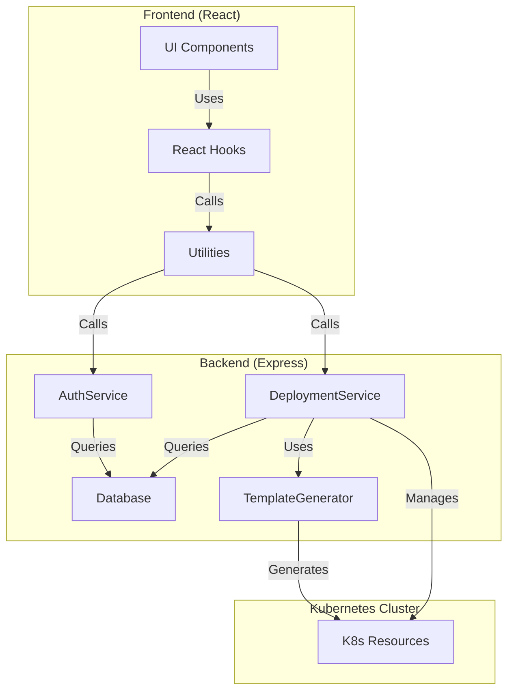

# Class Diagram and Data Model

Comprehensive class diagram showing all major classes, their attributes, methods, and relationships.

## Overall Architecture



## Complete Class Diagram

```mermaid
classDiagram
    %% User & Authentication
    class User {
        -id: number
        -username: string
        -email: string
        -password_hash: string
        -created_at: Date
        -updated_at: Date
        -rancher_api_url: string
        -rancher_api_token: string
        -rancher_cluster_id: string
        +getDeployments() List~Deployment~
        +updateProfile(email, password) void
        +deleteAccount() void
    }

    class AuthToken {
        -userId: number
        -username: string
        +generateToken() string
        +verifyToken() AuthToken
        +hashPassword(password) string
        +verifyPassword(password, hash) boolean
    }

    %% Deployment & Configuration
    class Deployment {
        -id: string
        -user_id: number
        -name: string
        -namespace: string
        -yaml_config: string
        -deployment_config: JSON
        -status: string
        -environment: string
        -workloads_count: number
        -resources_count: number
        -created_at: Date
        -updated_at: Date
        +create() void
        +update() void
        +delete() void
        +getResources() List~K8sResource~
        +deleteResource(K8sResource) void
        +getYAML() string
    }

    class GlobalConfig {
        -namespace: string
        -domain: string
        -requestsPerSecond: string
        -resourceQuota: JSON
        +validate() boolean
        +apply() void
    }

    class Workload {
        -id: string
        -name: string
        -type: string
        -containers: List~Container~
        -config: JSON
        +addContainer(Container) void
        +removeContainer(Container) void
        +getContainers() List~Container~
        +toYAML() string
    }

    class Container {
        -id: string
        -name: string
        -image: string
        -ports: List~Port~
        -env: List~EnvVar~
        -resources: Resources
        -volumeMounts: List~VolumeMount~
        +addPort(Port) void
        +addEnv(EnvVar) void
        +setResources(Resources) void
        +toYAML() string
    }

    class Port {
        -containerPort: number
        -hostPort: number
        -name: string
        -protocol: string
    }

    class EnvVar {
        -name: string
        -value: string
    }

    class Resources {
        -cpu_request: string
        -memory_request: string
        -cpu_limit: string
        -memory_limit: string
    }

    %% Kubernetes Resources
    class K8sResource {
        -kind: string
        -name: string
        -namespace: string
        -apiVersion: string
        -deletable: boolean
        -metadata: JSON
        +delete() void
        +update() void
        +describe() string
    }

    class Service~K8sResource~ {
        -type: string
        -selector: JSON
        -ports: List~ServicePort~
        +expose() void
    }

    class HTTPRoute~K8sResource~ {
        -hostnames: List~string~
        -rules: List~Rule~
        +addRule(Rule) void
        +addHostname(string) void
    }

    class NetworkPolicy~K8sResource~ {
        -podSelector: JSON
        -ingress: List~IngressRule~
        -egress: List~EgressRule~
    }

    class ResourceQuota~K8sResource~ {
        -cpu_request: string
        -memory_request: string
        -cpu_limit: string
        -memory_limit: string
    }

    class BackendTrafficPolicy~K8sResource~ {
        -rateLimit: RateLimit
        -timeout: Timeout
        +setRateLimit(RateLimit) void
    }

    class RateLimit {
        -requests: number
        -unit: string
    }

    %% Services
    class AuthService {
        -jwt_secret: string
        -jwt_expiry: string
        +signup(username, password) AuthToken
        +login(username, password) AuthToken
        +logout() void
        +getCurrentUser() User
        +updatePassword(oldPassword, newPassword) void
        +deleteAccount() void
    }

    class DeploymentService {
        -kubeConfig: KubeConfig
        +createDeployment(Deployment) void
        +updateDeployment(Deployment) void
        +deleteDeployment(id) void
        +getDeployments(userId) List~Deployment~
        +getDeploymentYAML(id) string
        +deleteResource(K8sResource) void
        +getResources(deploymentId) List~K8sResource~
    }

    class TemplateGenerator {
        +generateTemplates(List~Workload~, GlobalConfig) TemplateResult
        +generateNamespace(string) string
        +generateClusterIP(List~Workload~) List~string~
        +generateHTTPRoute(string, List~string~) string
        +generateNetworkPolicy(string) string
        +generateResourceQuota(GlobalConfig) string
        +generateRateLimit(string, number) string
        +generateRBAC(string) string
    }

    class YAMLBuilder {
        +generatePodYAML(name, config, containers, namespace) string
        +generateDeploymentYAML(name, config, containers, namespace) string
        +generateStatefulSetYAML(name, config, containers, namespace) string
        +generateJobYAML(name, config, containers, namespace) string
        +generateCronJobYAML(name, config, containers, namespace) string
        +generateReplicaSetYAML(name, config, containers, namespace) string
    }

    class DatabaseConnection {
        -connectionPool: Pool
        +initializeDatabase() void
        +query(sql, params) Result
        +getPool() Pool
        +close() void
    }

    class KubeConfig {
        -cluster: ClusterConfig
        -context: ContextConfig
        -user: UserConfig
        +loadFromCluster() void
        +loadFromFile(path) void
        +getCurrentCluster() Cluster
        +getCurrentUser() User
    }

    %% UI Components
    class DeploymentPage {
        -deployments: List~Deployment~
        -selectedDeployment: Deployment
        -showResources: boolean
        +fetchDeployments() void
        +viewResources(Deployment) void
        +deleteDeployment(id) void
        +deleteResource(id, K8sResource) void
    }

    class CreateChartPage {
        -workloads: List~Workload~
        -globalConfig: GlobalConfig
        +addWorkload() void
        +removeWorkload() void
        +deployDeployment() void
    }

    class ContainerConfig {
        -name: string
        -image: string
        -ports: List~Port~
        -env: List~EnvVar~
        -resources: Resources
        +render() HTML
    }

    class GlobalConfigForm {
        -namespace: string
        -domain: string
        -requestsPerSecond: string
        -resourceQuota: JSON
        +validate() boolean
        +submit() void
    }

    %% Relationships
    User "1" --> "*" Deployment : creates
    User "1" --> "1" AuthToken : has
    Deployment "1" --> "*" Workload : contains
    Deployment "1" --> "1" GlobalConfig : uses
    Workload "1" --> "*" Container : has
    Container "1" --> "*" Port : exposes
    Container "1" --> "*" EnvVar : defines
    Container "1" --> "1" Resources : limits
    Deployment "1" --> "*" K8sResource : generates
    K8sResource <|-- Service : is-a
    K8sResource <|-- HTTPRoute : is-a
    K8sResource <|-- NetworkPolicy : is-a
    K8sResource <|-- ResourceQuota : is-a
    K8sResource <|-- BackendTrafficPolicy : is-a
    BackendTrafficPolicy "1" --> "1" RateLimit : has
    AuthService --> User : manages
    AuthService --> AuthToken : creates
    DeploymentService --> Deployment : manages
    DeploymentService --> K8sResource : manages
    DeploymentService --> KubeConfig : uses
    TemplateGenerator --> Workload : processes
    TemplateGenerator --> GlobalConfig : processes
    YAMLBuilder --> Container : processes
    DatabaseConnection --> Deployment : stores
    DatabaseConnection --> User : stores
    DeploymentPage --> DeploymentService : calls
    DeploymentPage --> Deployment : displays
    CreateChartPage --> TemplateGenerator : uses
    CreateChartPage --> DeploymentService : calls
    ContainerConfig --> Container : renders
    GlobalConfigForm --> GlobalConfig : renders
```



## Class Details

### User Class

```
User
├── Properties:
│   ├── id: number (PK)
│   ├── username: string
│   ├── email: string
│   ├── password_hash: string
│   ├── created_at: Date
│   ├── updated_at: Date
│   ├── rancher_api_url: string (optional)
│   ├── rancher_api_token: string (optional)
│   ├── rancher_cluster_id: string (optional)
│   └── namespace_counter: number
├── Methods:
│   ├── getDeployments(): Deployment[]
│   ├── createDeployment(config): Deployment
│   ├── updateProfile(email, password): void
│   └── deleteAccount(): void
└── Relationships:
    ├── 1:N → Deployment (user creates many deployments)
    └── 1:1 → AuthToken (user has auth token)
```

### Deployment Class

```
Deployment
├── Properties:
│   ├── id: string (UUID)
│   ├── user_id: number (FK)
│   ├── name: string
│   ├── namespace: string
│   ├── yaml_config: string (stored YAML)
│   ├── deployment_config: JSON (form data)
│   ├── status: "active" | "failed" | "pending"
│   ├── environment: "staging" | "production"
│   ├── workloads_count: number
│   ├── resources_count: number
│   ├── created_at: Date
│   └── updated_at: Date
├── Methods:
│   ├── create(): void
│   ├── update(): void
│   ├── delete(): void
│   ├── getResources(): K8sResource[]
│   ├── deleteResource(resource): void
│   └── getYAML(): string
└── Relationships:
    ├── N:1 ← User (belongs to user)
    ├── 1:N → Workload (contains workloads)
    ├── 1:1 → GlobalConfig (has config)
    └── 1:N → K8sResource (generates resources)
```

### Workload Class

```
Workload
├── Properties:
│   ├── id: string
│   ├── name: string
│   ├── type: "Pod"|"Deployment"|"StatefulSet"|"ReplicaSet"|"Job"|"CronJob"
│   ├── containers: Container[]
│   └── config: JSON (workload-specific settings)
├── Methods:
│   ├── addContainer(container): void
│   ├── removeContainer(container): void
│   ├── getContainers(): Container[]
│   ├── validate(): boolean
│   └── toYAML(): string
└── Relationships:
    ├── N:1 ← Deployment (belongs to deployment)
    └── 1:N → Container (has containers)
```

### Container Class

```
Container
├── Properties:
│   ├── id: string
│   ├── name: string
│   ├── image: string
│   ├── ports: Port[]
│   ├── env: EnvVar[]
│   ├── resources: Resources
│   ├── volumeMounts: VolumeMount[]
│   └── config: JSON
├── Methods:
│   ├── addPort(port): void
│   ├── addEnv(envVar): void
│   ├── setResources(resources): void
│   ├── validate(): boolean
│   └── toYAML(): string
└── Relationships:
    ├── N:1 ← Workload (belongs to workload)
    ├── 1:N → Port (exposes ports)
    ├── 1:N → EnvVar (defines env vars)
    └── 1:1 → Resources (has resource limits)
```

### K8sResource Class Hierarchy

```
K8sResource (Abstract)
├── Properties:
│   ├── kind: string
│   ├── name: string
│   ├── namespace: string
│   ├── apiVersion: string
│   ├── deletable: boolean
│   └── metadata: JSON
├── Methods:
│   ├── delete(): void
│   ├── update(): void
│   ├── describe(): string
│   └── validate(): boolean
└── Subclasses:
    ├── Service (deletable: true)
    │   ├── type: "ClusterIP"|"LoadBalancer"
    │   ├── selector: JSON
    │   └── ports: ServicePort[]
    ├── HTTPRoute (deletable: true)
    │   ├── hostnames: string[]
    │   └── rules: Rule[]
    ├── NetworkPolicy (deletable: false)
    │   ├── podSelector: JSON
    │   ├── ingress: IngressRule[]
    │   └── egress: EgressRule[]
    ├── ResourceQuota (deletable: false)
    │   ├── cpu_request: string
    │   ├── memory_request: string
    │   ├── cpu_limit: string
    │   └── memory_limit: string
    └── BackendTrafficPolicy (deletable: false)
        ├── rateLimit: RateLimit
        └── timeout: Timeout
```

### GlobalConfig Class

```
GlobalConfig
├── Properties:
│   ├── namespace: string
│   ├── domain: string
│   ├── requestsPerSecond: string
│   └── resourceQuota: {
│       ├── cpu_request: string
│       ├── memory_request: string
│       ├── cpu_limit: string
│       └── memory_limit: string
│   }
├── Methods:
│   ├── validate(): boolean
│   ├── apply(): void
│   └── toJSON(): JSON
└── Relationships:
    └── N:1 ← Deployment (used by deployment)
```

### AuthService Class

```
AuthService
├── Properties:
│   ├── jwt_secret: string
│   └── jwt_expiry: string
├── Methods:
│   ├── signup(username, password): AuthToken
│   ├── login(username, password): AuthToken
│   ├── logout(): void
│   ├── getCurrentUser(token): User
│   ├── verifyToken(token): AuthToken | null
│   ├── updatePassword(userId, oldPassword, newPassword): void
│   ├── updateEmail(userId, newEmail): void
│   ├── deleteAccount(userId): void
│   ├── hashPassword(password): string
│   └── verifyPassword(password, hash): boolean
└── Relationships:
    ├── Uses → User (manages users)
    └── Creates → AuthToken (generates tokens)
```

### DeploymentService Class

```
DeploymentService
├── Properties:
│   ├── kubeConfig: KubeConfig
│   ├── database: DatabaseConnection
│   └── k8sClient: KubernetesClient
├── Methods:
│   ├── createDeployment(deployment): void
│   ├── updateDeployment(deployment): void
│   ├── deleteDeployment(id): void
│   ├── getDeployments(userId): Deployment[]
│   ├── getDeploymentYAML(id): string
│   ├── getDeploymentForEdit(id): JSON
│   ├── getResources(deploymentId): K8sResource[]
│   ├── deleteResource(deploymentId, resource): void
│   └── deleteResourcesFromCluster(yaml, namespace): void
└── Relationships:
    ├── Manages → Deployment
    ├── Manages → K8sResource
    ├── Uses → KubeConfig
    └── Uses → DatabaseConnection
```

### TemplateGenerator Class

```
TemplateGenerator
├── Methods:
│   ├── generateTemplates(workloads, config): TemplateResult
│   ├── generateNamespace(namespace): string
│   ├── generateClusterIP(workloads): string[]
│   ├── generateHTTPRoute(domain, hostnames): string
│   ├── generateNetworkPolicy(namespace): string
│   ├── generateResourceQuota(config): string
│   ├── generateRateLimit(namespace, requestsPerSecond): string
│   ├── generateRBAC(namespace): string
│   ├── generateCertificate(domain): string
│   └── generateBackupSchedule(namespace): string
└── Relationships:
    ├── Processes → Workload
    ├── Processes → GlobalConfig
    └── Uses → YAMLBuilder
```

### YAMLBuilder Class

```
YAMLBuilder
├── Methods:
│   ├── generatePodYAML(name, config, containers, namespace): string
│   ├── generateDeploymentYAML(name, config, containers, namespace): string
│   ├── generateStatefulSetYAML(name, config, containers, namespace): string
│   ├── generateReplicaSetYAML(name, config, containers, namespace): string
│   ├── generateJobYAML(name, config, containers, namespace): string
│   ├── generateCronJobYAML(name, config, containers, namespace): string
│   ├── generateConfigMapYAML(name, data, namespace): string
│   ├── generateSecretYAML(name, data, namespace): string
│   └── buildYAML(object): string
└── Relationships:
    ├── Processes → Workload
    └── Processes → Container
```

### DatabaseConnection Class

```
DatabaseConnection
├── Properties:
│   ├── connectionPool: Pool
│   ├── connectionString: string
│   └── isConnected: boolean
├── Methods:
│   ├── initializeDatabase(): void
│   ├── query(sql, params): Result
│   ├── getPool(): Pool
│   ├── close(): void
│   └── health(): boolean
└── Relationships:
    ├── Stores → User
    ├── Stores → Deployment
    └── Used by → DeploymentService
```

### KubeConfig Class

```
KubeConfig
├── Properties:
│   ├── cluster: ClusterConfig
│   ├── context: ContextConfig
│   ├── user: UserConfig
│   ├── isInCluster: boolean
│   └── token: string
├── Methods:
│   ├── loadFromCluster(): void
│   ├── loadFromFile(path): void
│   ├── getCurrentCluster(): Cluster
│   ├── getCurrentUser(): User
│   ├── getCurrentContext(): Context
│   └── getAuthToken(): string
└── Relationships:
    └── Used by → DeploymentService
```

## Data Flow

### Deployment Creation Flow

```
User Input (UI)
    ↓
ValidationService.validate()
    ↓
TemplateGenerator.generateTemplates()
    ↓
YAMLBuilder.generateXXXYAML()
    ↓
Deployment Object Created
    ↓
DeploymentService.createDeployment()
    ↓
DatabaseConnection.query() [Save to DB]
    ↓
KubeConfig.loadFromCluster()
    ↓
K8sClient.apply(yaml) [Deploy to K8s]
    ↓
K8sResource Objects Created
    ↓
Success Response
```

### Authentication Flow

```
User Login Request
    ↓
AuthService.login()
    ↓
DatabaseConnection.query() [Fetch User]
    ↓
AuthService.verifyPassword()
    ↓
AuthToken Generated
    ↓
AuthToken.generateToken() [Create JWT]
    ↓
Token Returned to Client
    ↓
Token Stored (localStorage)
    ↓
Future Requests Include Token
    ↓
authMiddleware.verify(token)
    ↓
AuthToken.verifyToken()
    ↓
Request Authorized
```

## Interface Relationships Summary

| Interface | Relations | Purpose |
|-----------|-----------|---------|
| **User** | 1:N → Deployment | Represents user accounts |
| **Deployment** | 1:N → Workload, 1:1 → GlobalConfig | Represents K8s deployments |
| **Workload** | 1:N → Container | Represents workload types |
| **Container** | 1:N → Port, 1:N → EnvVar, 1:1 → Resources | Container configuration |
| **GlobalConfig** | N:1 ← Deployment | Global namespace settings |
| **K8sResource** | 1:N ← Deployment | Kubernetes resources |
| **AuthToken** | 1:1 ← User | Authentication tokens |
| **AuthService** | Manages → User | Authentication operations |
| **DeploymentService** | CRUD → Deployment | Deployment operations |
| **TemplateGenerator** | Generates → YAML | Template generation |
| **DatabaseConnection** | Stores → All data | Database operations |

---

This class diagram provides a complete view of the application architecture, showing all classes, their properties, methods, and relationships.
